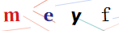
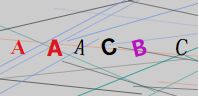

# react-vcode [](https://www.npmjs.com/package/react-vcode) [](https://codebeat.co/projects/github-com-javaluo-react-vcode-master) [](https://www.npmjs.com/package/react-vcode)
一个简单的React验证码组件

## 示例图






## 1. 安装

````
npm install react-vcode
````

## 2. 使用

````
import Vcode from 'react-vcode';

 <Vcode />
 
````

## 3. 自定义参数

可自行设置覆盖原有值

````javascript
value               // string  受控，不设置的话将随机生成验证码 (支持的值: 普通字符串/网络图片路径/import的本地图片/base64)
onChange            // func    回调，生成新的验证码时触发，将新的验证码字符串返回上级 (如果value字段被传入了图片，将返回null)
onClick             // func    回调，点击组件本身时触发，外部可通过此回调来更新需要传入的验证码 (如果没设置value，点击就会自动重新生成二维码)
length: 4           // number  生成几位验证码（没设置value时有效）
width: 150          // number  容器宽度(px)
height: 40          // number  容器高度(px)
className           // string  自定义容器样式class
style: {            // object  容器默认样式 (注：如果在style中设置width和height,将覆盖上面通过属性设置的width和height)
  position: 'relative',
  backgroundColor: '#fff',
  overflow: 'hidden',
  cursor: 'pointer',
  verticalAlign: 'middle',
  userSelect: 'none',
}
options:{           // 验证码相关自定义参数
  codes: [          // 所有可能出现的字符
    'a', 'b', 'c', 'd', 'e', 'f', 'g', 'h', 'i', 'j', 'k', 'l', 'm',
    'o', 'p', 'q', 'r', 's', 't', 'x', 'u', 'v', 'y', 'z', 'w', 'n',
    '0', '1', '2', '3', '4', '5', '6', '7', '8', '9',
  ],
  fontSizeMin: 22,  // 字体尺寸最小值
  fontSizeMax: 26,  // 字体尺寸最大值
  colors: [         // 字可能的颜色
    '#117cb3',
    '#f47b06',
    '#202890',
    '#db1821',
    '#b812c2',
  ],
  fonts: [          // 可能的字体
    'Times New Roman',
    'Georgia',
    'Serif',
    'sans-serif',
    'arial',
    'tahoma',
    'Hiragino Sans GB',
  ],
  lines: 8,         // 生成多少根干扰线
  lineColors: [     // 线可能的颜色
    '#7999e1',
    '#383838',
    '#ec856d',
    '#008888',
  ],
  lineHeightMin: 1, // 线的粗细最小值
  lineHeightMax: 1, // 线的粗细最大值
  lineWidthMin: 20, // 线的长度最小值
  lineWidthMax: 60, // 线的长度最大值
}

// 例子：

<Vcode
  length={6}
  onChange={(v) => {console.log('当前的验证码值：', v)}}
  options={{ codes: [ 'A', 'B', 'C' ] }}
/>
````

## 4. 手动刷新验证码
```javascript
<Vcode ref={(obj)=>this.vcode = obj} />

this.vcode.onClick(); // 调用内部的onClick方法可刷新验证码
```

## 5. 额外说明

- 之前用过一个验证码插件叫 vcode.js, 不知道作者。 本react-vcode是通过vcode.js的源码进行修改加工，转成了react组件。感谢原作者。

## 更新日志

1.0.3 - 2019/03/11<br/>
- 去掉UNSAFE_componentWillReceiveProps，使用componentDidUpdate
- 修复动态改变width、height、style时不刷新的问题
